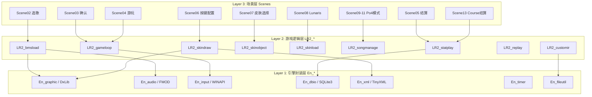
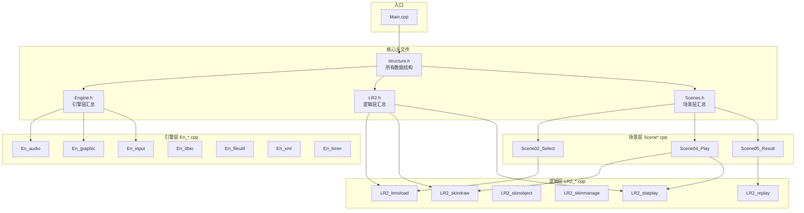

# OpenLR2 项目架构文档

> **OpenLR2** 是 BMS 播放器 Lunatic Rave 2 (LR2) 的重写版本。
> 项目始于 2021年1月，当前主构建目标是 **Windows x86 / Visual Studio 2022**；代码使用 C++23，并保留了一些非 Windows/DxLib-for-Linux 的适配痕迹，但 CMake 目前仍在非 Windows 平台直接中止配置。

---

## 1. 目录结构总览

```
OpenLR2/
├── CMakeLists.txt              # CMake 构建配置
├── CMakePresets.json           # CMake 预设
├── OpenLR2_vs22.sln            # Visual Studio 2022 解决方案
├── OpenLR2_vs22.vcxproj        # VS 项目文件
├── OpenLR2.manifest            # Windows 程序清单
├── README.md                   # 项目说明
│
├── LR2/                        # 🎯 核心游戏源码
│   ├── Main.cpp                # 程序入口：Windows 下 WinMain 转发到 main
│   ├── structure.h             # 所有数据结构定义（最核心头文件）
│   ├── Engine.h                # 引擎层入口（封装 DxLib/FMOD/SQLite）
│   ├── LR2.h                   # 游戏逻辑层入口
│   ├── Scenes.h                # 场景层入口（所有场景头文件）
│   ├── strclass.h/cpp          # 字符串类 CSTR
│   ├── filesystem.h            # 文件系统头
│   ├── dbgtool.h/cpp           # 调试工具
│   │
│   ├── En_*.h/cpp              # 🔧 引擎/底层封装层
│   │   ├── En_audio.*          # 音频封装 (FMOD)
│   │   ├── En_graphic.*        # 图形封装 (DxLib)
│   │   ├── En_input.*          # 输入封装 (键盘/MIDI)
│   │   ├── En_dbio.*           # 数据库 IO (SQLite3)
│   │   ├── En_fileutil.*       # 文件工具 (哈希/编码/文件检测)
│   │   ├── En_xml.*            # XML 读写 (TinyXML)
│   │   ├── En_timer.*          # 计时器/FPS
│   │   ├── En_value.*          # 数值范围工具
│   │   └── En_recordmovie.*    # 录像/MP3 编码
│   │
│   ├── LR2_*.h/cpp             # 🎮 游戏业务逻辑层
│   │   ├── LR2_audio.*         # 音频管理 (加载/播放/淡出)
│   │   ├── LR2_bmsload.*       # BMS 谱面解析 & 加载
│   │   ├── LR2_skinload.*      # 皮肤脚本加载
│   │   ├── LR2_skindraw.*      # 皮肤绘制 (DrawingBuf 系统)
│   │   ├── LR2_skinobject.*    # 皮肤控件交互 (按钮/滑块/文本)
│   │   ├── LR2_skinmanage.*    # 皮肤管理 (列表/选择/预览)
│   │   ├── LR2_songmanage.*    # 歌曲/数据库管理
│   │   ├── LR2_configsave.*    # 配置读写 (XML)
│   │   ├── LR2_gameloop.*      # 游戏主循环 (ReactInput)
│   │   ├── LR2_statplay.*      # 成绩统计/保存
│   │   ├── LR2_statlong.*      # 长期玩家统计
│   │   ├── LR2_replay.*        # Replay 录制/回放
│   │   ├── LR2_ghost.*         # Ghost 对手数据
│   │   ├── LR2_ir.*            # 互联网排名 (IR)
│   │   ├── LR2_customir.*      # CustomIR 插件系统
│   │   └── LR2_makemp3.*       # MP3/AVI 导出
│   │
│   └── Scene*_*.h/cpp          # 🎬 场景系统
│       ├── Scene02_Songselect.* # 歌曲选择
│       ├── Scene03_Decide.*     # 歌曲确认
│       ├── Scene04_Play.*       # 游玩主场景
│       ├── Scene05_Result.*     # 结算画面
│       ├── Scene06_Keyconfig.*  # 按键设置
│       ├── Scene07_Skinselect.* # 皮肤选择
│       ├── Scene08_Lunaris.*    # 小游戏 LUNARIS
│       ├── Scene09_Po4menu.*    # Po4 模式菜单
│       ├── Scene10_Po4decide.*  # Po4 模式确认
│       ├── Scene11_Po4select.*  # Po4 模式选择
│       └── Scene13_Courseresult.* # Course 结算
│
├── lib/                        # 📚 第三方库/头文件
│   ├── DxLib/                  # DxLib (定制版 3.24f, 支持旧 dxa；仓库内为 Windows .lib)
│   ├── FMOD/                   # FMOD 音频引擎（仓库内为 Windows x86/x64 导入库和 DLL）
│   ├── sqlite/                 # SQLite3 (源码级包含)
│   ├── tinyxml/                # TinyXML (源码级包含)
│   ├── md5.h/cpp               # MD5 哈希
│   └── inttypes.h              # 类型兼容
│
├── SkinEditor/                 # 🖌️ 独立皮肤编辑器 (SDL3 + ImGui)
│   ├── main.cpp                # 编辑器入口
│   ├── skin.h/cpp              # 皮肤逻辑
│   ├── seWindowManager.h/cpp   # 窗口管理器
│   ├── winWorkspace.h/cpp      # 工作区
│   ├── ImageLoader.h/cpp       # 图片加载
│   ├── imgui/                  # ImGui 源码
│   └── SDL3/                   # SDL3 源码及当前 Windows 预编译库
│
├── ExampleIR/                  # 📡 CustomIR 插件示例
│   ├── ExternalIR.cpp          # DLL 插件示例代码
│   └── README.md               # 说明文档
│
└── OpcodeScript/               # 🐍 皮肤 Opcode 代码生成工具
    ├── OpcodeScript.py         # 主脚本
    ├── !!README.txt            # 使用说明
    └── *OP.txt / *.h           # Opcode 定义 & 生成的 C 头文件
```

---

## 2. 架构分层

OpenLR2 代码大体按 **引擎封装 / 游戏逻辑 / 场景** 分层组织，但 `Engine.h` 中的作者注释也说明当前分离并不彻底：大量状态仍通过 `structure.h` 的全局 `game` 聚合结构共享，层间耦合较高。



### Layer 1: 引擎封装层 (`En_*`)
- 封装底层库（DxLib 图形/窗口/输入辅助、FMOD 音频、SQLite 数据库、TinyXML 解析）
- 提供部分操作系统抽象（文件 IO、MIDI 输入、计时器），但仍存在 Win32 API、DxLib API 直接出现在 `Main.cpp`、场景代码和 SkinEditor 中的情况
- 对上层屏蔽了一部分具体库实现细节，但不是完整平台抽象层

### Layer 2: 游戏逻辑层 (`LR2_*`)
- BMS 谱面加载、音频管理、皮肤系统、歌曲数据库管理
- 成绩统计与保存、Replay 录制、IR 联网排名
- 通过 `structure.h` 中定义的所有数据结构共享游戏状态

### Layer 3: 场景层 (`Scene*`)
- 每个场景是一个独立的状态处理器，包含 `ProcI_*`(输入处理) 和 `ProcS_*`(状态处理) 和 `Proc_*`(绘制) 函数
- 场景由 `game.procSelecter` 切换（值为 2-13）

---

## 3. 核心数据结构

> 所有数据结构定义在 `LR2/structure.h` 中（约 1500 行）

### 3.1 全局游戏状态 `struct game`

```cpp
struct game {
    struct ConfigStruct config;        // 全局配置
    struct SONGSELECT sSelect;         // 歌曲选择状态
    struct skstruct skstruct {};       // 皮肤数据 (1P)
    struct skstruct skstruct2 {};      // 皮肤数据 (2P)
    struct SkinManage skinData;        // 皮肤管理器
    struct inputStructure KeyInput;    // 输入状态
    struct Timer timer1;               // 计时器1
    struct Timer timer2;               // 计时器2
    struct RECORDING rec;              // 录像状态
    struct TextStruct txtStruct;       // 文本结构
    struct AUDIO audio;                // 音频系统
    struct gameplay gameplay;          // 游玩状态 (谱面/按键音)
    struct NETWORK net;                // 网络状态
    int procSelecter;                  // 当前场景ID (0=退出, 2-13=主要场景)
    int procPhase;                     // 场景内阶段
    std::vector<std::future<...>> hThreadBanner; // 异步线程
    CSTR baseDirectory;                // 程序目录
    CSTR directoryPath;                // 直接启动 BMS/媒体时的路径
    // ... 其他标志位
};
```

### 3.2 游玩状态 `struct gameplay`

```cpp
struct gameplay {
    int keymode;                       // 键位模式 (5/7/9/10/14)
    struct LaneStruct bmsobj;          // BMS 谱面总对象
    struct LaneStruct bmsobj_note[20]; // 20 条轨道 (Note 数据)
    struct LaneStruct bmsobj_line;     // BPM 线数据
    struct BPMtiming *bpmt_data;       // BPM 时间轴
    struct SOUNDDATA keysound[SLOTS];  // 按键音 (38440 slots)
    struct PLAYERSTATUS player[2];     // 玩家状态 [0]=1P, [1]=2P
    struct PREVIEW preview;            // 预览/音源
    // ...
};
```

### 3.3 皮肤系统 `struct skstruct`

皮肤系统是 LR2 最复杂的子系统之一：

```cpp
struct skstruct {
    // 基础
    char op[1000]{};                   // Option 位图
    int scenetime{};                   // 场景时长
    int loadstart/end{};               // 加载区间
    int playstart{};                   // 播放起点
    int fadeout{};                     // 淡出时长

    // 资源
    int GrHandle[200]{};               // 图形句柄
    struct ImageFont ImageFonts[10]{}; // 位图字体
    struct SkinObject image{};         // 图片控件
    struct SkinObject otherObject[8]{}; // 其他控件 (文本/按钮/滑块/...)

    // Bar 元素 (歌曲选择列表)
    struct SRCstruct src_BAR_*[10]{};  // SRC 源 (各种BAR资源)
    struct DSTstruct dst_BAR_*[30]{};  // DST 目标 (BAR状态/动画)

    // 游戏内元素
    struct SRCstruct src_NOTE[20]{};   // 音符资源
    struct DSTstruct dst_NOTE[20]{};   // 音符状态
    struct SRCstruct src_LINE[2]{};    // 判定线
    struct SRCstruct src_JUDGELINE[2]{};      // 判定线/判定相关显示
    struct SRCstruct src_GAUGECHART_1P[2]{};  // 1P 血条图表
    struct SRCstruct src_GAUGECHART_2P[2]{};  // 2P 血条图表

    // 绘制缓冲区
    struct DrawingBuf drBuf{};         // 绘制缓冲
    // ...
};
```

### 3.4 SRC/DST 控件模型

这是 LR2 皮肤系统的核心抽象，每个可视元素由一对 SRC/DST 描述：

| 类型 | 含义 | 示例 |
|------|------|------|
| `SRCstruct` | **Source（源）**：定义元素的外观资源 | 图片句柄、字体句柄、切分帧数、循环周期 |
| `DSTstruct` | **Destination（目标）**：定义元素的状态/行为 | 位置、大小、透明度、旋转、动画时间线 |
| `DSTdraw` | **具体绘制帧**：某一时刻的精确绘制参数 | 坐标 (x,y,w,h)、混合模式、角度、颜色 |
| `DrawingBuf` | **绘制缓冲区**：收集所有待绘制元素后统一渲染 | DSTdraw 数组 |

### 3.5 歌曲数据 `struct SONGDATA`
```cpp
struct SONGDATA {
    CSTR title, subtitle, artist, genre; // 元信息
    CSTR hash;                          // MD5 哈希
    CSTR filepath, folder;              // 文件路径
    int level, difficulty;              // 难度
    int keymode;                        // 键位模式
    int maxBPM, minBPM;                 // BPM 范围
    struct STATUS mybest;               // 自己的最佳成绩
    struct STATUS rivalRecord;          // Rival 成绩
    int grHandle;                       // 图形句柄
    // ... 课程(Course)相关字段
};
```

### 3.6 成绩数据 `struct STATUS`
```cpp
struct STATUS {
    int stat_pgreat, stat_great, stat_good, stat_bad, stat_poor; // 判定数
    int clear;                         // 通关类型
    int stat_exscore;                  // EX 分数
    int stat_maxcombo;                 // 最大连击
    int playcount, clearcount, failcount;
    int op_history, op_best;           // Option 历史
    int IRranking;                     // IR 排名
};
```

---

## 4. 场景系统

### 场景生命周期

每个场景有3个核心函数：

| 函数模式 | 含义 | 调用时机 |
|----------|------|----------|
| `ProcI_<Scene>(game*)` | 输入处理 | 每帧调用，处理玩家输入和交互 |
| `ProcS_<Scene>(game*)` | 场景状态/绘制处理 | 每帧调用，执行绘制和部分状态推进 |
| `Proc_<Scene>(game*, sk*, Timer*)` | 细分绘制逻辑 | 部分场景提供，例如 Result 的 `Proc_Result`；不是所有场景都有 |

### 场景切换

通过 `game.procSelecter` 枚举值控制：

| 值 | 场景 | 功能 |
|----|------|------|
| 2 | `Scene02_Songselect` | 歌曲选择界面（主菜单） |
| 3 | `Scene03_Decide` | 歌曲确认/准备界面 |
| 4 | `Scene04_Play` | 游玩主场景（核心） |
| 5 | `Scene05_Result` | 结算画面 |
| 6 | `Scene06_Keyconfig` | 按键配置 |
| 7 | `Scene07_Skinselect` | 皮肤选择 |
| 8 | `Scene08_Lunaris` | 内置小游戏 |
| 9-11 | `Scene09/10/11_Po4*` | 模式的 Po4 菜单/选择/确认 |
| 13 | `Scene13_Courseresult` | Course 模式结算 |

### 程序入口（Main.cpp 流程）

```
WinMain(Windows) → main
   1. 解析命令行参数 (-ns, -auto 等)
   2. 设置程序目录，复制默认配置文件
   3. 加载配置 (XML)、MIDI/按键配置、玩家成绩数据库
   4. 初始化 DxLib (窗口/图形/输入相关设置)
   5. 初始化皮肤、IR/CustomIR、歌曲数据库
   6. 加载歌曲列表和初始皮肤
   7. 主循环:
      while(true) {
          ProcessMessage()    // DxLib/窗口消息
          ProcessInput()      // 输入处理
          scene_ProcS()       // 当前场景绘制/状态处理
          scene_ProcI()       // 当前场景输入处理
          ScreenFlip()        // 翻页显示
          if(procSelecter == 0) break;
      }
   8. 清理资源
```

---

## 5. 皮肤系统详解

### 5.1 皮肤文件格式

LR2 皮肤使用类 CSV 的自定义脚本格式，定义 SRC/DST 对。

- Opcode 列表由 `OpcodeScript/` 中的 Python 脚本生成 C 头文件
- SkinEditor 是一个独立的 SDL3+ImGui 编辑器，但当前实现仍包含 Windows/DxLib 依赖，并在顶层 CMake 中只在 `WIN32` 时构建

### 5.2 控件类型

在 `skstruct` 中通过 `otherObject[8]` 数组索引：

| 索引 | 类型 | 说明 |
|------|------|------|
| 0 | Text | 文本显示 |
| 1 | Button | 按钮交互 |
| 2 | Slider | 滑块控件 |
| 3 | OnMouse | 鼠标悬停效果 |
| 4 | BGA | 背景动画 |
| 5 | Bargraph | 柱状图/进度条 |
| 6 | Number | 数字显示 |
| 7 | Mask | 遮罩 |

### 5.3 绘制流程

```
1. LoadScene()          加载皮肤脚本 → 初始化 SRC/DST
2. 每帧:
   - SetObjectValue_*()  更新控件状态（血量、分数...）
   - AddDrawingBuffer_*() 向绘制缓冲区添加元素
   - LRDraw()            批量渲染 DrawingBuf
```

### 5.4 SRC 循环动画

```cpp
int GetSRCcycleNow(SRCstruct src, double time);
```
SRC 支持基于时间的帧序列动画，通过 `cycle` 和 `count` 控制切分和循环。

### 5.5 DST 时间线动画

```cpp
DSTdraw DSTDbyTime(DSTdraw* dstd1, DSTdraw* dstd2, double t1, double t2, double tO);
```
DST 通过关键帧插值实现平滑动画（位置/大小/透明度/旋转）。

---

## 6. 游玩核心流程

### 6.1 BMS 谱面加载 (`LR2_bmsload`)

```
ParseBmsFile() → 解析 BMS 文件
   ├── 解析 #WAV/#BMP/#BPM 等头信息
   ├── 解析 #xxx 通道数据（Note 放置）
   ├── 构建 BPM 时间轴 (BPMtiming)
   ├── 加载按键音 (keysound[SLOTS])
   └── 拆分轨道 (DPsplit/DPtoSP/SPtoDP)
```

### 6.2 游玩主循环 (`Scene04_Play`)

```
ProcGame() → 每帧执行
   ├── InputToButton()      输入映射 (键盘/MIDI → 按键)
   ├── ProcNoteOnTiming()   判定处理 (Note → Judge)
   │   ├── ProcSinglenote() 单点 Note
   │   └── ProcLongnote()   长条 Note
   ├── ApplyJudgeNote()     判定应用 (闪白/出现效果)
   ├── JudgeToScore()       分数计算
   ├── DrawNotes()          绘制 Note
   ├── DrawJudgeCombo()     绘制判定/连击
   ├── DrawHPgauge()        绘制血量
   └── ReplayDataToInput()  回放输入 (如果是回放模式)
```

### 6.3 判定系统

| Judge 值 | 含义 | 说明 |
|----------|------|------|
| 0 | PGREAT | 完美 |
| 1 | GREAT | 优 |
| 2 | GOOD | 良 |
| 3 | BAD | 可 |
| 4 | POOR | 差 |
| 5 | MINE | 地雷 (扣血) |

---

## 7. 数据存储

### 7.1 SQLite 数据库

- 存储路径: `LR2files/Database/Score/`
- 核心功能:
  - 歌曲列表缓存 (BMS 索引)
  - 成绩记录 (STATUS)
  - 玩家统计 (PLAYERSTATISTIC)
  - Ghost 数据
  - Course 数据

### 7.2 配置文件 (XML)

| 文件 | 读取函数 | 写入函数 |
|------|----------|----------|
| 主配置 | `ReadConfig()` | `WriteConfigXml()` |
| OpenLR2 专有配置 | `ReadOpenLr2Config()` | `WriteOpenLr2ConfigXml()` |
| 按键配置 | `ReadKeyConfig()` | `WriteKeyConfig()` |
| MIDI 配置 | `ReadMIDI()` | `WriteMidiXml()` |
| 皮肤自定义 | `ReadSkinCustomize()` | `WriteSkinCustomizeXml()` |

---

## 8. 输入系统

### 8.1 输入类型

- **键盘**: 通过 DxLib 的键盘检测
- **MIDI**: Windows 下通过 WinMM MIDI API；非 Windows 代码目前只有解析/空实现级别的适配
- **Replay 输入**: 从 Replay 文件读取模拟输入

### 8.2 按键映射

不同键位模式有不同的按钮→按键映射：

| 模式 | 函数 |
|------|------|
| 5Keys | `ConfigButtonToKeyID5()` / `ConfigButtonFromKeyID5()` |
| 7Keys | `ConfigButtonToKeyID7()` / `ConfigButtonFromKeyID7()` |
| 9Keys | `ConfigButtonToKeyID9()` / `ConfigButtonFromKeyID9()` |

---

## 9. CustomIR 插件系统

允许第三方开发者编写 Windows DLL 插件来发送成绩到自定义服务器（如 Bokutachi）。当前实现使用 `LoadLibraryW`/`GetProcAddress`，并通过文件名后缀区分 x86/x64/Debug。

### 9.1 接口

```cpp
struct MethodTable {
    const char* (*GetName)();       // 模块名称（必须）
    bool (*LoginV1)();              // 登录/初始化
    SendScoreStatus (*SendScoreV1)(const IRScoreV1& score); // 发送成绩
};
```

### 9.2 加载流程

```
CUSTOMIR_MANAGER::Initialize(LR2files/CustomIRs/)
   → 扫描子目录
   → 在每个子目录内查找匹配架构后缀的 DLL
   → GetMethodTable() 获取方法表
   → Login() 初始化

CUSTOMIR_MANAGER::SendScore()
   → 每个模块异步发送 (std::future)
```

---

## 10. 外部依赖

| 库 | 版本 | 用途 | 集成方式 |
|----|------|------|----------|
| **DxLib** | 定制 3.24f | 图形渲染、窗口管理、基础 IO | Windows .lib，当前 CMake 仅配置 Windows |
| **FMOD** | 2.3.10 | 音频播放 (BGM/按键音) | Windows 导入库 + DLL，当前 CMake 仅配置 Windows |
| **SQLite** | 3.6.7 compat | 数据库存储 | 源码静态库 |
| **TinyXML** | - | XML 配置文件解析 | 源码静态库 |
| **MD5** | Zunawe/md5-c | BMS 哈希、成绩校验 | 源码静态库 |
| **SDL3** | 3.x | SkinEditor 窗口/渲染 | 当前顶层 CMake 使用 `SkinEditor/SDL3.lib`，仅 Windows |
| **ImGui** | - | SkinEditor GUI 框架 | 源码 (仅 SkinEditor) |

---

## 11. 构建系统

### 构建方式

- **主要**: Visual Studio 2022 (`OpenLR2_vs22.sln`)
- **替代**: CMake (`CMakeLists.txt` + `CMakePresets.json`，当前预设只覆盖 Windows VS Win32)
- **目标**: x86 Release / MT 链接；CMake 中设置 `CMAKE_MSVC_RUNTIME_LIBRARY` 为 MT/MTd
- **非 Windows 状态**: `CMakeLists.txt` 对 FMOD 和 DxLib 都有 `else() message(FATAL_ERROR ...)`，因此 Linux/macOS/Android/iOS 目前不会完成配置

### 构建产物

| 目标 | 输出 | 说明 |
|------|------|------|
| `OpenLR2` | `OpenLR2.exe` | 主程序 |
| `SkinEditor` | `SkinEditor.exe` | 皮肤编辑器 (仅 Windows) |
| `OpenLR2Lib` | (静态库) | 核心游戏库 |

---

## 12. 子项目

### SkinEditor
- 独立应用程序，使用 SDL3 + ImGui
- 功能：可视化编辑 LR2 皮肤脚本
- 编译：顶层 CMake 中仅 Windows 构建，使用仓库内 `SkinEditor/SDL3.lib`
- 共享 `OpenLR2Lib` 静态库中的核心逻辑，同时自身也包含 Windows/DxLib 入口依赖

### ExampleIR
- CustomIR 插件示例
- 展示如何编写 DLL 插件接收成绩数据
- 示例将成绩保存为文本文件

### OpcodeScript
- Python 脚本工具
- 从 Opcode 定义文件生成 C 头文件
- 用于皮肤系统的 Opcode 常量定义

---

## 13. 关键技术要点

### 13.1 编码支持
- 目标是 UTF-8 支持（无需切换系统区域），入口处调用 `SetUseCharCodeFormat(DX_CHARCODEFORMAT_UTF8)` 和 `SetFontCharCodeFormat`
- 代码中包含 CP932/UTF-8、Windows 宽字符 API、路径兼容相关处理；跨平台时需要重新审计大小写、Unicode 规范化和路径分隔符

### 13.2 线程模型
- 主线程：游戏循环（输入→逻辑→渲染）
- 异步线程：Banner 加载、皮肤预览、MP3 编码、CustomIR 发送
- 数据库操作部分使用全局 mutex (`g_db_lock`)，但不是所有数据库访问都自动串行化

### 13.3 特殊功能
- **GAS (Gauge Auto Shift)**: 失败时自动切换到更容易的判定槽
- **Fast/Slow**: 判定偏移显示（早/晚）
- **Quick Restart**: Start+Select 快速重启
- **MainBPM Hi-Speed Fix**: 基于主 BPM 的变速锚定
- **Base62**: 支持更多按键音槽位 (SLOTS=38440)

---

## 14. 文件关系图



---

> 📝 **文档版本**: 基于 2026-05-30 构建 (`version 260530`)
> 📝 **原作者注**: 原始 LR2 代码在 `LR2Beta3-v100201` 分支

---

## 15. 跨平台/ARM 移植评估

### 15.1 当前可移植性结论

当前项目不是“重新编译即可跨平台”的状态。虽然部分文件里有 `_WIN32` 条件分支、非 Windows stub、`std::filesystem` 和 `std::thread` 的使用，但主要运行时仍依赖：

- **DxLib Windows 版**：图形、窗口、输入、图片/视频/字体等大量 API。
- **FMOD Windows 预编译库**：仓库只带 Windows x86/x64 DLL 和 import lib。
- **Win32/WinMM API**：窗口消息、MIDI、DLL 插件加载、文件枚举/复制、消息框、DirectInput 相关配置。
- **CustomIR ABI**：Windows DLL + `LoadLibraryW`/`GetProcAddress`，跨平台需要重做插件加载和发布格式。
- **旧 LR2 数据目录假设**：运行时依赖 `LR2files/`、原版配置/数据库/皮肤/资源布局。

### 15.2 平台难度

| 平台 | 难度 | 主要原因 |
|------|------|----------|
| Windows ARM64 | 中-高 | 系统 API 仍可用，但 DxLib/FMOD/插件必须有 ARM64 Windows 版本；现有 CMake/VS 预设固定 Win32，CustomIR DLL ABI 也要新增 ARM64 后缀和发布规范。短期可优先依赖 x86/x64 仿真运行。 |
| Linux x86_64/ARM64 | 高 | 需要替换或完整引入 Linux 可用图形/窗口/输入层；当前 CMake 直接禁止非 Windows；MIDI、文件枚举、CustomIR、录像输出和字体/编码路径都要重做。 |
| macOS ARM64 | 很高 | DxLib Windows 依赖不可用，且 macOS 图形/窗口/输入/动态库/MIDI/打包签名都不同；还要处理大小写敏感路径、bundle 资源路径、权限与音频设备。 |
| Android ARM | 极高 | 需要移动端生命周期、触控/外设输入、资源访问、JNI/NDK 构建、音频低延迟、存储权限、屏幕适配；原 LR2 桌面 UI 和文件目录假设需要重构。 |
| iOS ARM64 | 极高 | 除 Android 的移动端问题外，还受 App Store/JIT/动态库加载/文件访问/后台行为限制；CustomIR 插件模型基本不可直接保留。 |

### 15.3 推荐移植路线

1. **先做平台边界清理**
   - 把 DxLib、FMOD、Win32/MIDI、动态库加载、录像输出集中到明确的 platform/backend 接口。
   - 禁止业务层和场景层继续直接包含 Win32/DxLib 头，逐步把调用收口到 `En_*` 或新 backend。

2. **先保持 Windows x86/x64 可运行**
   - 在现有 Visual Studio/CMake 上建立可重复 CI。
   - 把 Win32/x86 作为行为基准，补充皮肤加载、BMS 解析、判定、数据库迁移、Replay 的回归测试。

3. **替换渲染/窗口/输入后端**
   - 桌面端建议优先评估 SDL3 + GPU/OpenGL/Metal/Vulkan 后端，SkinEditor 已经引入 SDL3，可作为技术路线参考。
   - 需要为 DxLib 常用函数建立兼容层或逐步改写 `En_graphic`、`LR2_skindraw`、BGA/视频、字体和图片加载。

4. **替换音频后端或补齐 FMOD 多平台发布**
   - 如果继续使用 FMOD，需要引入每个平台对应 SDK、许可和 CMake 查找逻辑。
   - 如果改用开源后端，需要特别验证 BMS 按键音低延迟、多音同时播放、seek、预览淡入淡出和录音/导出。

5. **重做平台服务**
   - MIDI：Windows WinMM、Linux ALSA/JACK/PipeWire、macOS CoreMIDI、移动端外设 MIDI 分别适配。
   - 插件：Windows DLL、Linux `.so`、macOS `.dylib` 可做桌面多 ABI；Android/iOS 建议改为内置模块或网络 API 配置，不使用任意动态插件。
   - 文件系统：资源根目录、用户数据目录、大小写、Unicode、沙盒权限全部抽象。

6. **平台顺序建议**
   - 第一阶段：Windows x64/ARM64 清理构建矩阵，解决 32 位假设和库架构问题。
   - 第二阶段：Linux 桌面，因为更容易用 SDL3/OpenGL/FMOD 或替代音频验证跨平台 backend。
   - 第三阶段：macOS ARM64，重点处理 Metal/OpenGL 可用性、bundle、签名、公证、CoreMIDI。
   - 第四阶段：Android/iOS，需要先把桌面输入/UI/文件模型拆开，否则成本会指数上升。
